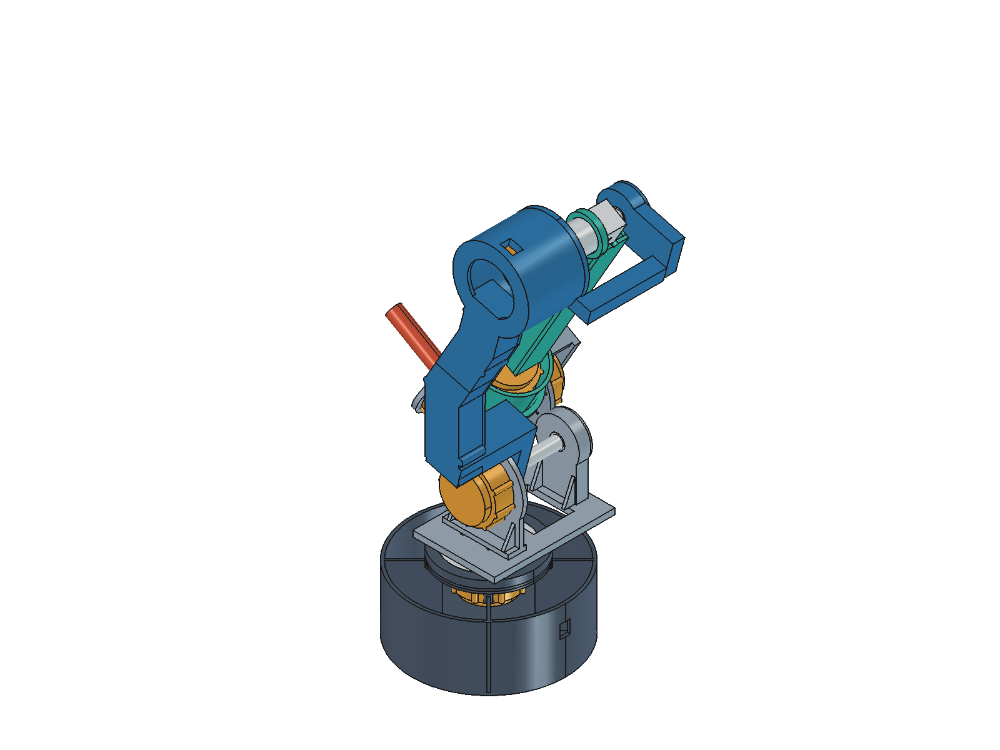

# Arm：六轴机械臂 CAD

本仓库管理我们自己的机械臂设计、参数、脚本、工程记录与导出文件。下载的参考仓库、含上游网格的参考装配、说明书摘录及缓存不提交。

## 哪个模型是我们的机械臂？

| 模型 | 路径 | 用途 | 是否提交 |
|---|---|---|---|
| **我们的机械臂** | [mechanical/freecad/Robot_Master.FCStd](mechanical/freecad/Robot_Master.FCStd) | 当前主装配，FreeCAD打开，默认HOME | 是 |
| PAROL6参考装配 | `mechanical/freecad/PAROL6_reference_assembly.FCStd` | 按上游URDF重建的研究参考 | 否，仅本地 |
| CyberGear详细参考 | `mechanical/freecad/CyberGear_Detail.FCStd` | 两份原始电机网格 | 否，仅本地 |
| CyberGear简化模型 | [mechanical/freecad/CyberGear_Envelope.FCStd](mechanical/freecad/CyberGear_Envelope.FCStd) | 按接口数据建立的简化实体 | 是 |

`Arm_v1_*.FCStd`是第一阶段历史粗模。当前使用 `Robot_Master.FCStd` 与 `master_parameters.json`，不要混用第一阶段参数和验证结论。



## 当前工程状态

六轴基线为180 / 320 / 290 / 60 / 35 / 90 mm。J1～J3已建立开口底座、双侧支撑、分段盒形大臂、可拆轴承支撑和试装孔位；J4～J6是装配占位。四个离散姿态通过当前简化实体的穿透检查，未验证连续运动路径。

当前产物可用于静态打印试装，不能直接作为带载样机制造发布包。J2水平伸展时仅远端电机自重的重力矩下界约6.63 N·m，超过参考额定4 N·m，仍需处理转矩方案、轴锁紧、轴承和真实接口验证。

- [使用与验证报告](mechanical/docs/master_stage2_review.md)
- [装配顺序](mechanical/docs/assembly_concept.md)
- [未解决问题](mechanical/docs/unresolved_issues.md)
- [完整STEP](mechanical/exports/Robot_Master_coarse.step)
- [本地第二阶段文件清单](mechanical/docs/stage2_files.md)：包含被Git排除的本地参考产物，克隆本仓库后这些链接不会全部存在。
- [来源与许可证记录](mechanical/docs/reference_license_notes.md)：数值接口来自参考测量，保留来源，不因独立脚本而推定全部权利已获授权。

## 重建我们自己的模型

需要带Python模块的FreeCAD；当前已验证FreeCAD 1.1.3。Windows PowerShell在仓库根目录执行（按实际安装位置修改路径）：

```powershell
$armFreeCadPython = 'D:\Program Files\FreeCAD_1.1.3-Windows-x86_64-py311\bin\python.exe'
& $armFreeCadPython mechanical/scripts/build_robot_master.py
& $armFreeCadPython mechanical/scripts/check_robot_master.py
& $armFreeCadPython mechanical/scripts/export_robot_deliverables.py
```

这些步骤使用仓库内保存的接口测量数据，不需要下载PAROL6/Thor，也不导入其几何。界面操作和姿态宏见使用报告。重建会更新脚本管理的同名输出；人工修改请另存副本。

## 可选：恢复本地参考研究环境

仅当需要重新导入参考装配、提取电机孔位或运行完整 `build_stage2.ps1` 时下载参考。以下命令适用于目标目录尚不存在的全新克隆；已有目录应先检查，不能覆盖：

```powershell
git clone https://github.com/Source-Robotics/PAROL6-Desktop-robot-arm.git reference/PAROL6
git -C reference/PAROL6 checkout 3892e9c85c1f6d8041cda01c47c9db9d18b30ad8
git clone https://github.com/AngelLM/Thor.git reference/Thor
git -C reference/Thor checkout 286b081fe6f056d87c379b884781ef77ff6a0159
git clone https://github.com/freezeLUO/CyberGear.git reference/cybergear/upstream
git -C reference/cybergear/upstream checkout db450fa86455ab1edd0c744fc6aef4e810573014
```

`reference/`整体被忽略，不使用submodule，不随本仓库推送。原始用户SLDASM也保留在本地。历史环境记录中“Arm不是Git仓库”描述的是建模开始时的状态；之后已在Arm根目录建立本仓库。
