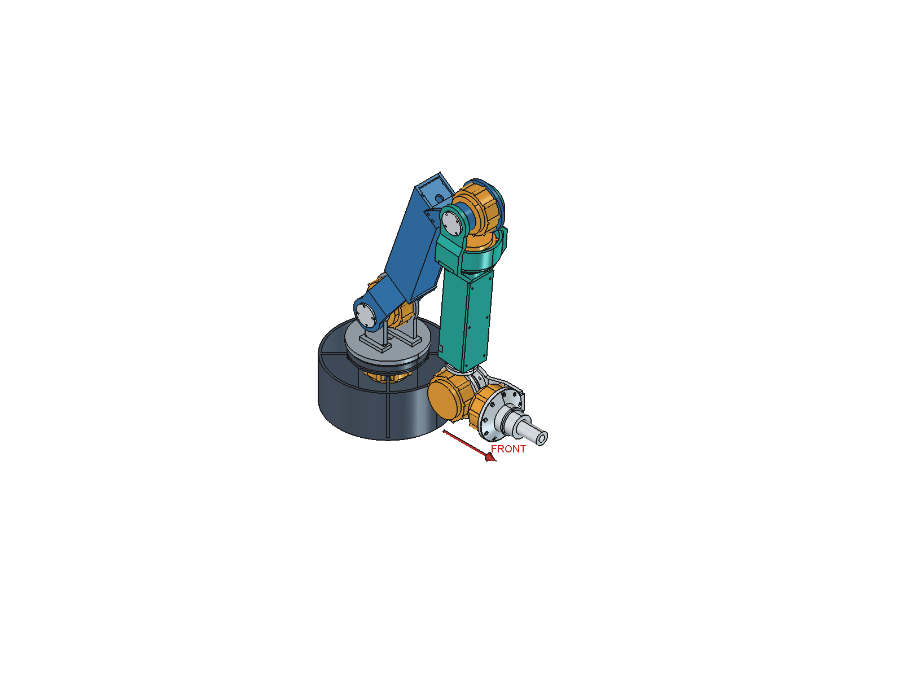

# arm_0

六轴机械臂机械 CAD。当前唯一正式主工程为 **[mechanical/freecad/arm_0.FCStd](mechanical/freecad/arm_0.FCStd)**，FreeCAD 文档标签为 `arm_0 | Prototype 0`。



## 当前入口

| 内容 | 文件 |
|---|---|
| 我们自己的主装配 | [arm_0.FCStd](mechanical/freecad/arm_0.FCStd) |
| 参数 | [arm_0_parameters.json](mechanical/arm_0_parameters.json) |
| 完整 STEP | [arm_0.step](mechanical/exports/arm_0.step) |
| V3 拓扑与量化报告 | [arm_0_v3_review.md](mechanical/docs/arm_0_v3_review.md) |
| 装配顺序 | [assembly_concept.md](mechanical/docs/assembly_concept.md) |
| 待解决事项 | [unresolved_issues.md](mechanical/docs/unresolved_issues.md) |
| 文件清单 | [arm_0_files.md](mechanical/docs/arm_0_files.md) |
| PAROL6 参考装配（仅本地） | `mechanical/freecad/PAROL6_reference_assembly.FCStd` |
| CyberGear 参考 | `CyberGear_Detail.FCStd` 与 `CyberGear_Envelope.FCStd` |

旧侧向错层方案完整归档在 [mechanical/legacy/v2](mechanical/legacy/v2/README.md)，标记为 SUPERSEDED。上一个35 mm腕距的大框腕部保存在 [V3腕部快照](mechanical/legacy/v3_box_wrist/README.md)。第一阶段 `Arm_v1_*` 文件也仅为历史。它们的姿态和验证结果不适用于 V3。

## V3 结构

- 当前尺寸为180 / 320 / 290 / 60 / 86 / 90 mm；用户确认将J5→J6的Flange从35改为86 mm。原轴序/转向保持，两根主体盒梁回到Y=0。
- J2由大臂双叉包住，J3由小臂双叉包住；短输出hub加对侧短轴颈，取消长贯穿传动轴。
- J3定子仍固定在大臂。J4电机包络中心前移到距J3约63.75 mm处，扭矩管随roll转动，将动力传到腕部。
- J5/J6在伸直姿态前后排列，移除两层大框；J6_OnePieceConnector是一体金属连接件，J5采用输出侧可拆轴承座。工具接头可拆。
- 采用前折STOW；HOME为其附近的小幅前向展开。启动路径使用不超过2°的关节插值采样检查，不能理解为解析连续碰撞证明或实机安全认证。

当前为工程粗模与静态试装候选。电机接口为REFERENCE-DERIVED / HARDWARE VERIFY；轴承未采购定型，载荷、打印工艺和金属件加工配合尚待验证。J2额定转矩问题仍待解决；单侧金属连接件的刚度、夹紧和轴承力矩能力也需核算。Flange变化后的姿态和包络已重算，ArmDesigner中的历史参数不会自动同步。

## 使用 FreeCAD

打开 `arm_0.FCStd`，选择 PoseController 的 CurrentPose，再运行 `mechanical/scripts/SetArm0Pose.FCMacro`。仅修改下拉框不会自动移动实体。

修改 MasterParameters 后运行 `RebuildArm0.FCMacro`，生成CUSTOM副本并另存；表格不会自动重建几何，也不会写回JSON。原基线中Flange已按本轮授权调整为86 mm，该尺寸更改后需重新验证完整运动；其余五项尺寸保持锁定。更改几何后应重新搜索姿态并验证，不沿用旧报告。

PowerShell在仓库根目录运行（按安装位置设置FreeCAD自带Python）：

```powershell
& .\mechanical\scripts\build_arm_0.ps1
# 修改拓扑后重新搜索前折姿态并验证：
& .\mechanical\scripts\build_arm_0.ps1 -SearchDocking
```

`ReviewArm0.FCMacro`用于生成原生CAD截图，应在独立FreeCAD进程运行，结束后关闭该进程。参考几何不参与主模型构建，参考研究需要的额外下载见 [来源记录](mechanical/docs/reference_license_notes.md)。`reference/`、原始SolidWorks文件、含上游网格的参考文件、说明书摘录、缓存和备份均不推送。
