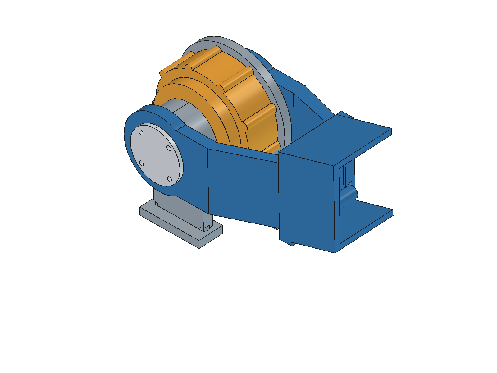
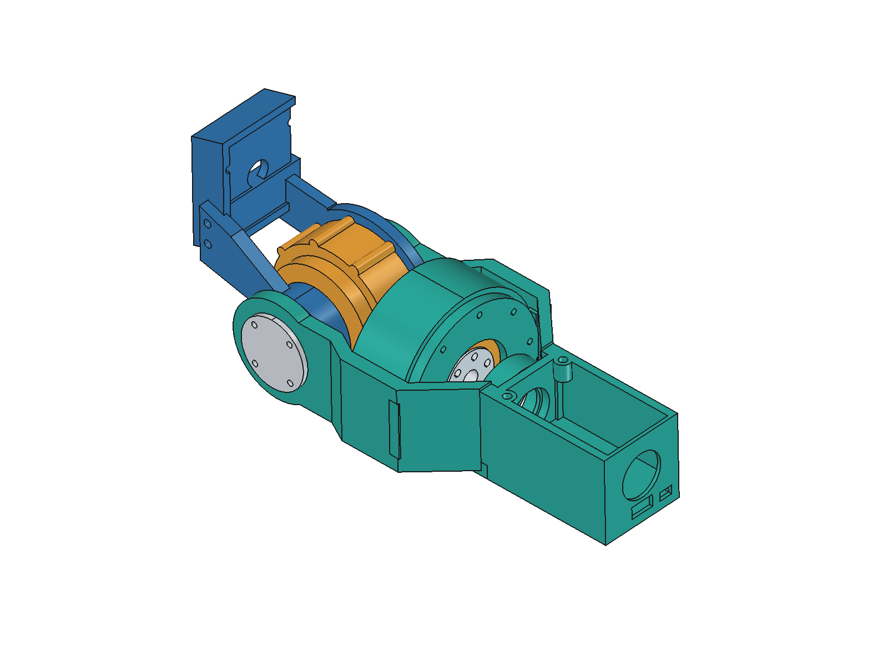
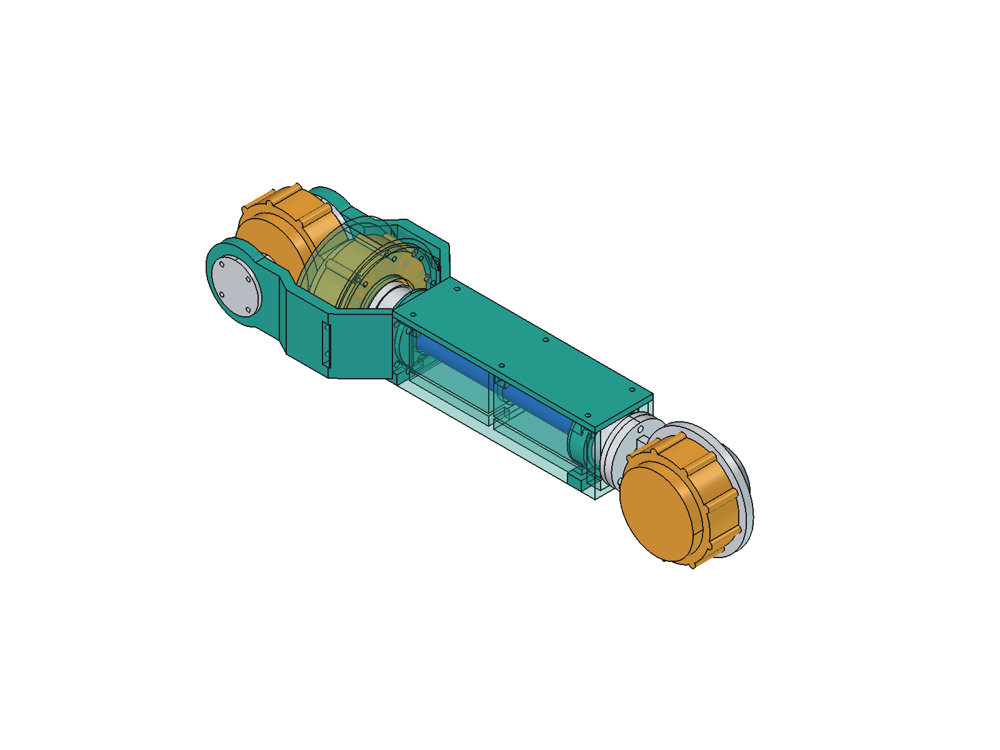
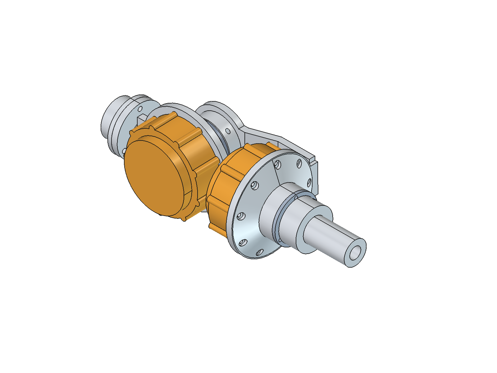
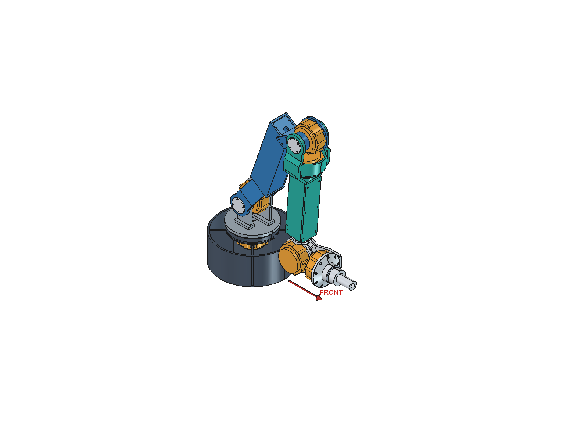
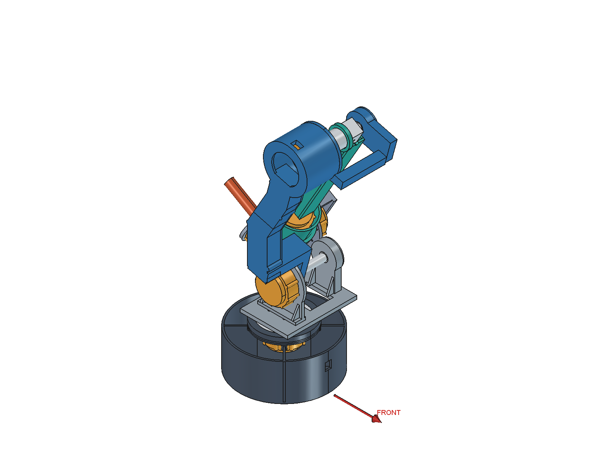

# arm_0 V3：机械拓扑、前折与制造粗模报告

**正式主文件：[arm_0.FCStd](../freecad/arm_0.FCStd)，文档Label为 `arm_0 | Prototype 0`。** 本轮为物理CAD拓扑重构；源FK函数和六轴转向未修改。当前为静态试装工程粗模，尚非带载制造发布版。

## Topology

V2依赖大/小臂中心横向相隔132 mm、长贯穿轴及三个远端电机。V3用子连杆局部双叉包住父关节，主体回到Y=0；J4沿原roll轴线移至近端，J5/J6留在腕部。所有正式几何由本项目独立脚本建立，不导入PAROL6/Thor零件。

| 关节 | 定子/固定侧 owner | 转子/输出侧 owner | 运动学正角轴向 |
|---|---|---|---|
| J1 | base | yaw | +Z |
| J2 | yaw | upper | 父架局部-Y |
| J3 | upper | fore | 大臂局部-Y |
| J4 | fore | roll | 小臂局部+X |
| J5 | roll | pitch | roll局部-Y |
| J6 | pitch | tool | pitch局部+X |

电机安装朝向与运动学正角符号分开：J2/J3/J5输出面朝局部+Y。J2/J3代表点和两根中央盒梁均取Y=0；`FoldLane/UpperLane`只保留为锁定零值的历史兼容项。

## J2

大臂输出侧叉片直接接短金属hub；对侧叉片用独立短轴颈进入固定轴承支撑。两叉在约80 mm处通过端框并回中央大臂。J2_ThroughShaft已经从正式模型中移除。

| 指标 | 当前值 |
|---|---|
| 整体关节宽度 | 86 mm（Y=-48…38，含短轴颈外法兰） |
| 子叉片包络 | 83 mm（Y=-45…38） |
| 短轴颈 | Ø19.8×25 mm；含3 mm外法兰总长28 mm，metal |
| 短输出hub | 18 mm轴向范围，metal |
| 对侧轴承 | 20×32×10，GEOMETRIC PLACEHOLDER |
| 支承间距说明 | 输出面到对侧轴承占位中心46 mm；电机内部承载中心未知，未确认真实轴承跨距 |

## J3

J3定子、前安装支撑和对侧轴承支撑继续属于Rigid_upper。小臂两叉、输出hub和短轴颈属于Rigid_fore。内部隔框承接可拆支撑的紧固载荷，盖板不是唯一承力件。

J3关节局部宽86 mm，轴颈与轴承占位沿用J2的25 mm和20×32×10。为包住近端J4，叉片局部最大宽104 mm，在约112 mm处并回50 mm中央盒梁。**112 mm超过最初50～80 mm建议**，这是容纳真实电机包络及可拆安装的局部让步；没有恢复整根侧向错层。

当前前折使用负J3方向，已验证-150°；局部检查中0°、+90°、-90°与-150°没有穿透，-152°/-155°开始发生大臂与J4壳体等冲突。+150°是相反方向的回折，存在多处穿透，明确排除。当前搜索边界[-150°,100°]是CAD约束，不是已选定的实物限位，也不证明边界内任意关节组合都安全。

## J4

| 指标 | V3 |
|---|---|
| 旧/新输出面距J3 | 290 → 82 mm |
| 新电机轴向包络中心距J3 | 63.75 mm，位于30～80 mm目标区域 |
| 数学J4原点 | 仍在J3之后290 mm；移动的是同一轴线上的执行器 |
| 扭矩管 | OD22 / ID17 / 壁2.5 / 长192 mm，metal，PROVISIONAL |
| 管位置 | 小臂坐标x=90…282 mm |
| 支承 | 近端与远端22.2×32×10轴承占位，带肩座及可拆压盖 |
| 支承中心距 | x=109与267 mm，相距158 mm |
| 接头 | 近端输出适配器、开缝夹紧概念、远端输出hub，均归Rigid_roll |

轴承和管的0.1 mm径向间隙只用于几何占位。管、接头与末端hub随q4转动；定子和小臂壳保持在Rigid_fore。原生FCStd测试用管上的偏轴见证点确认了该归属。

角部线槽为8×5 mm，位于Y=12…20、Z=-22…-17，贯穿筋、端框和轴承座。实测对扭矩管间距约9.81 mm、对远端旋转接头约2.81 mm；未检出线槽与实体体积冲突。实际线径、线束弯曲和接插件方向仍需确定。

| 水平电机自重重力矩下界 | V2 / N·m | V3 / N·m | 变化 / N·m |
|---|---:|---:|---:|
| J2 | 6.6270 | 6.1434 | -0.4836 |
| J3 | 2.8083 | 2.3247 | -0.4836 |

使用CyberGear参考质量下限314 g及水平包络最小力臂。这里只算电机贡献，不含结构/管/线缆/负载。**J2下界仍为6.14 N·m，超过参考4 N·m额定转矩。**

## J5/J6

经用户确认，Flange由35改为86 mm，其余180/320/290/60/90 mm基线及FK轴序/转向保持。伸直时J5整台电机位于J6后方，两轴垂直；J5转动后J6绕其运动。原来的两层大框均移除。

J5改用紧凑金属定子支架与独立输出侧轴承座；J6_OnePieceConnector整合夹紧座、单侧6 mm腹板、J6安装环和轴承鼻座。J6工具接头另行拆装，使轴承可装入。轴承仍为15×32×9占位，短轴Ø14.8，J5/J6夹持长12/13 mm；没有完成刚度、预紧或摩擦传扭认证。

伸直腕部包围盒XYZ由181.00 × 187.00 × 98.00 mm改为232.00 × 93.00 × 88.00 mm，宽度缩减50.3%。电机X向包络分离10.14 mm。尺寸包含J5/J6所有物理零件与90 mm工具占位。

局部J5角度-120/-90/-45/0/45/90/120°通过抽样实体和间隙检查；这不是整个角域的连续无碰撞认证。CAKE_APPROACH已重算到原目标[500,0,210] mm。旧大框快照见 mechanical/legacy/v3_box_wrist。

## Links

| 主体 | 中心Y | 截面 | 壁 / 筋 |
|---|---:|---|---|
| Upper | 0 mm | 54×64 mm | 4.5 / 4.5 mm |
| Forearm | 0 mm | 50×54 mm | 4.5 / 4.5 mm |

大臂在190 mm过渡段内上抬54 mm，约15.87°；这是实体浅弯，不替代320 mm轴间距。主体最大横向中心偏置为0，关节处才局部加宽。采用空心截面、筋、端框、内部安装隔框和可拆盖板，未把整根连杆做成厚实心块。

## Docking

`front_direction`是可配置水平向量，默认来自J1到工作区方向[1,0,0]。对J3/J4/J5/J6、TCP和主要组件包围盒中心进行前方投影检查；还验证了方向旋转90°后的协变性。

| 姿态 | J1 / J2 / J3 / J4 / J5 / J6（°） |
|---|---|
| STOW | 0 / 55 / -150 / 0 / 95 / 0 |
| HOME | 0 / 52 / -142 / 0 / 90 / 0 |
| SAFE_UNFOLD | 0 / 50 / -110 / 0 / 60 / 0 |
| CAKE_APPROACH | 0 / 60.4966 / -72.4523 / 0 / -78.0443 / 0 |

| 启动路径 | 最大关节变化 | TCP行程 | 腕部J5行程 | 最大后方越界 | 外部最小间隙 | 采样点 |
|---|---:|---:|---:|---:|---:|---:|
| STOW→HOME | 8.0° | 45.40 mm | 45.40 mm | 0.00 mm | 1.000 mm | 5 |
| HOME→SAFE_UNFOLD | 32.0° | 189.95 mm | 189.95 mm | 0.00 mm | 1.000 mm | 17 |

STOW→HOME所有被检查主要中心的最小前方投影为152.94 mm；HOME→SAFE_UNFOLD为194.76 mm。J1全程不变，没有180°转身解折。SAFE_UNFOLD的400 mm特征长度缩放几何Jacobian条件数约6.28，本次数值筛查没有接近秩亏；不是完整控制安全证明。

| STOW与启动比较 | V2后折 | V3前折 |
|---|---:|---:|
| STOW物理径向包围范围 | 230.62 mm | 329.65 mm |
| STOW物理高度 | 541.10 mm | 485.13 mm |
| STOW→HOME最大关节变化 | 180.0° | 8.0° |
| STOW→HOME TCP行程 | 1016.58 mm | 45.40 mm |
| 启动最大后方越界 | 319.23 mm | 0.00 mm |
| 启动扫掠总包围盒XYZ | 616.3 × 285.7 × 822.8 mm | 478.0 × 210.0 × 485.1 mm |

径向范围用各实体世界包围盒角点保守计算；扫掠是采样全机（含静止底座）的联合包围盒，不是解析扫掠体或体积并集。旧版数据使用真实V2几何和原姿态，只重算运动指标，未重新认证旧路径无碰撞。

## Naming

正式入口、文件名、GUI标签、参数、宏和README已统一为arm_0。旧主文件、脚本、STEP、姿态图与试装件移至 `mechanical/legacy/v2/` 并标记SUPERSEDED。当前脚本中剩余旧名称只用于显式加载V2对比源；没有继续指向旧主工程的日常入口。PAROL6、CyberGear、Thor参考名称保持不变。

## Manufacturing

当前输出25个封闭打印候选STL、6份实体STEP及七份轻量局部包络。金属件与轴承不混入打印清单。各件尺寸见[文件清单](arm_0_files.md)及[export_checks.json](../../analysis/v3/export_checks.json)。

装配顺序、拆卸方向、压盖/叉片先后关系与工具访问见[assembly_concept.md](assembly_concept.md)。电机接口均为REFERENCE-DERIVED / HARDWARE VERIFY，轴承全部为GEOMETRIC PLACEHOLDER，无SELECTED COMPONENT。打印工艺、紧固件长度、金属锁紧和真实预紧仍未释放。

## Validation

FreeCAD原生模型包含66个有效单一实体组件（其中7个为隐藏空间预留），物理组件59个。每个姿态/路径采样检查1440组跨刚体对，另查271组同刚体零件对。没有按“相邻关节”豁免穿透。

所有物理实体交叠体积阈值为0.1 mm³。整体最小实体距离为0，来自明确列出的电机内部面和J1支承预期接触；这些对仍检查穿透。单列的轴承配合按至少0.08 mm检查，当前约0.1 mm；其他外部运动间隙按至少1 mm检查。不能把“外部1 mm”说成全部零件均隔开1 mm。

四个关键姿态及两段不超过2°步长的插值路径全部通过当前实体检查。**这是连续路径的离散采样检查，不是解析连续碰撞保证**，仍可能漏掉采样间更窄的干涉。线槽分区也通过实体检查。

| STEP回读 | 有效Solid数量 | 体积误差 / mm³ |
|---|---:|---:|
| arm_0.step | 59 | 0.42931761 |
| arm_0_J1.step | 9 | 0.00000000 |
| arm_0_J2.step | 10 | 0.00035971 |
| arm_0_J3.step | 12 | 0.00086570 |
| arm_0_wrist.step | 14 | 0.25088731 |
| arm_0_J6_OnePieceConnector.step | 1 | 0.20912386 |

STEP除完整有效实体数量外，还逐件验证质心/边界误差小于0.001 mm、相对体积误差小于1e-5；全文件体积误差须同时小于1 mm³和1e-5相对值。布尔曲面数值积分误差按实测值列出。

报告来源：[validation.json](../../analysis/v3/validation.json)、[export_checks.json](../../analysis/v3/export_checks.json)、[docking_search.json](../../analysis/v3/docking_search.json)。候选搜索记录保留过程，最终结论以记录最终脚本与参数哈希的validation为准。局部轴承/电机/壳体仍为简化几何。

## Remaining Issues

J2转矩余量、实际CyberGear孔位、接插件、夹紧接头和轴承选型是下一轮优先项。扭矩管远端短夹持、金属件加工、公差链、打印强度、线束动态弯曲和SAFE_UNFOLD→任务路径仍需继续。详细清单见[unresolved_issues.md](unresolved_issues.md)。

当前结果可用于模型核对和静态打印试装，不能直接声称带载可用。
